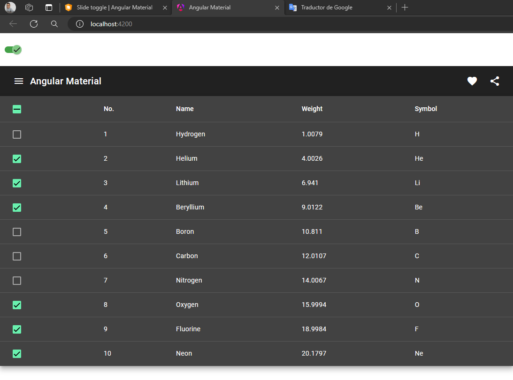
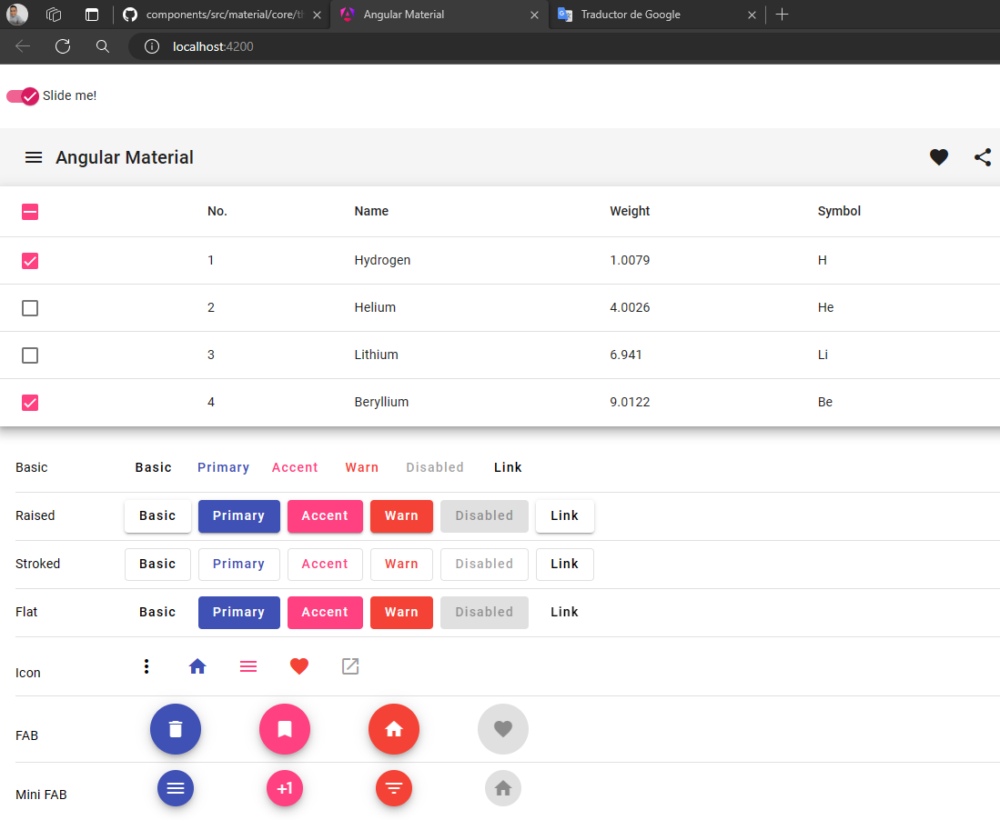

# Angular Material

This project was generated with [Angular CLI](https://github.com/angular/angular-cli) version 17.3.5.

**Capítulos**
- Capítulo 1: [Cómo instalar Angular Material en Angular 17](https://www.youtube.com/watch?v=2izPvkchsoA)
- Capítulo 2: [Teoría - Theming Angular Material](https://material.angular.io/guide/theming#defining-a-theme)
- Capítulo 3: [Cómo personalizar el tema de angular material | Angular 17?](https://www.youtube.com/watch?v=M7q2Ty-y2zQ) 

---

# Capítulo 1: [Cómo instalar Angular Material en Angular 17](https://www.youtube.com/watch?v=2izPvkchsoA)


## [Instalando Angular Material](https://material.angular.io/guide/getting-started)

Utilizando la terminal nos posicionamos en la raíz del proyecto de Angular y ejecutamos el siguiente comando `ng add @angular/material`, en el proceso de instalación iremos respondiendo ciertas preguntas:

```bash
$ ng add @angular/material

i Using package manager: npm
√ Found compatible package version: @angular/material@17.3.5.
√ Package information loaded.

The package @angular/material@17.3.5 will be installed and executed.
Would you like to proceed? Yes
√ Packages successfully installed.
? Choose a prebuilt theme name, or "custom" for a custom theme: Purple/Green [ Preview: https://material.angular.io?theme=purple-green ]
? Set up global Angular Material typography styles? Yes
? Include the Angular animations module? Include and enable animations
UPDATE package.json (1113 bytes)
√ Packages installed successfully.
UPDATE src/app/app.config.ts (366 bytes)
UPDATE angular.json (3055 bytes)
UPDATE src/index.html (544 bytes)
UPDATE src/styles.scss (182 bytes)
```

¡Ya terminaste! Angular Material ahora está configurado para usarse en su aplicación.

**IMPORTANTE**

> Una vez instalado `Angula Material` es muy importante que detengamos el proyecto y volvamos a levantarlo para que los cambios instalados se apliquen correctamente.

## Creando componente: mat-toolbar

Crearemos un componente de Angular para incorporar algún componente de Angular Material y ver cómo es que se ve en nuestro proyecto:

```bash
$ ng g c header --skip-tests
CREATE src/app/header/header.component.html (22 bytes)
CREATE src/app/header/header.component.ts (247 bytes)
CREATE src/app/header/header.component.scss (0 bytes)
```

En el componente `header.component.html` agregamos el siguiente código:

```html
<mat-toolbar>
  <button mat-icon-button class="example-icon" aria-label="Example icon-button with menu icon">
    <mat-icon>menu</mat-icon>
  </button>
  <span>Angular Material</span>
  <span class="example-spacer"></span>
  <button mat-icon-button class="example-icon favorite-icon" aria-label="Example icon-button with heart icon">
    <mat-icon>favorite</mat-icon>
  </button>
  <button mat-icon-button class="example-icon" aria-label="Example icon-button with share icon">
    <mat-icon>share</mat-icon>
  </button>
</mat-toolbar>
```

Mientras que en el componente `header.component.ts` de tipo standalone de typescript importamos los módulos de Angular material que estamos usando en el componente de `html`:

```typescript
import { Component } from '@angular/core';
import { MatIconModule } from '@angular/material/icon';
import { MatButtonModule } from '@angular/material/button';
import { MatToolbarModule } from '@angular/material/toolbar';

@Component({
  selector: 'app-header',
  standalone: true,
  imports: [MatToolbarModule, MatButtonModule, MatIconModule],
  templateUrl: './header.component.html',
  styleUrl: './header.component.scss'
})
export class HeaderComponent {

}
```

Ahora, para mostrar el componente `HeaderComponent` debemos importarlo en el componente `AppComponent` dentro de la sección de `imports` dado que
hemos creado el componente `HeaderComponent` del tipo StandAlone Component.

```typescript
@Component({
  selector: 'app-root',
  standalone: true,
  imports: [RouterOutlet, HeaderComponent],
  templateUrl: './app.component.html',
  styleUrl: './app.component.scss'
})
export class AppComponent {}
```

En el componente html `app.component.html` agregamos el selector del componente creado:

```html
<app-header />
```

## Creando componente: mat-table

Vamos a crear un componente en Angular par mostrar el componente de table de Angular material. Para eso creamos nuestro componente `table.component`:

```bash
$ ng g c table --skip-tests
CREATE src/app/table/table.component.html (21 bytes)
CREATE src/app/table/table.component.ts (243 bytes)
CREATE src/app/table/table.component.scss (0 bytes)
```

En el componente `table.component.html` agregamos el html de ejemplo mostrado en la página de Angular Material:

```html
<table mat-table [dataSource]="dataSource" class="mat-elevation-z8">

  <!-- Checkbox Column -->
  <ng-container matColumnDef="select">
    <th mat-header-cell *matHeaderCellDef>
      <mat-checkbox (change)="$event ? toggleAllRows() : null" [checked]="selection.hasValue() && isAllSelected()"
        [indeterminate]="selection.hasValue() && !isAllSelected()" [aria-label]="checkboxLabel()">
      </mat-checkbox>
    </th>
    <td mat-cell *matCellDef="let row">
      <mat-checkbox (click)="$event.stopPropagation()" (change)="$event ? selection.toggle(row) : null"
        [checked]="selection.isSelected(row)" [aria-label]="checkboxLabel(row)">
      </mat-checkbox>
    </td>
  </ng-container>

  <!-- Position Column -->
  <ng-container matColumnDef="position">
    <th mat-header-cell *matHeaderCellDef> No. </th>
    <td mat-cell *matCellDef="let element"> {{element.position}} </td>
  </ng-container>

  <!-- Name Column -->
  <ng-container matColumnDef="name">
    <th mat-header-cell *matHeaderCellDef> Name </th>
    <td mat-cell *matCellDef="let element"> {{element.name}} </td>
  </ng-container>

  <!-- Weight Column -->
  <ng-container matColumnDef="weight">
    <th mat-header-cell *matHeaderCellDef> Weight </th>
    <td mat-cell *matCellDef="let element"> {{element.weight}} </td>
  </ng-container>

  <!-- Symbol Column -->
  <ng-container matColumnDef="symbol">
    <th mat-header-cell *matHeaderCellDef> Symbol </th>
    <td mat-cell *matCellDef="let element"> {{element.symbol}} </td>
  </ng-container>

  <tr mat-header-row *matHeaderRowDef="displayedColumns"></tr>
  <tr mat-row *matRowDef="let row; columns: displayedColumns;" (click)="selection.toggle(row)">
  </tr>
</table>
```

En el componente de typescript agregamos loa módulos requeridos:

```typescript
@Component({
  selector: 'app-root',
  standalone: true,
  imports: [RouterOutlet, HeaderComponent, TableComponent],
  templateUrl: './app.component.html',
  styleUrl: './app.component.scss'
})
export class AppComponent {

}
```

## Creando componente: mat-slide-toggle

Crearemos el componente `slide-toggle`:

```bash
$ ng g c slideToggle --skip-tests
CREATE src/app/slide-toggle/slide-toggle.component.html (28 bytes)
CREATE src/app/slide-toggle/slide-toggle.component.ts (270 bytes)
CREATE src/app/slide-toggle/slide-toggle.component.scss (0 bytes)
```

```html
<section>
  <mat-slide-toggle class="example-margin" [checked]="checked" [disabled]="disabled">
    Slide me!
  </mat-slide-toggle>
</section>
```

```css
section {
  display: flex;
  align-content: center;
  align-items: center;
  height: 50px;
  padding: 10px;
}
```

```typescript
@Component({
  selector: 'app-slide-toggle',
  standalone: true,
  imports: [MatSlideToggleModule],
  templateUrl: './slide-toggle.component.html',
  styleUrl: './slide-toggle.component.scss'
})
export class SlideToggleComponent {
  checked = false;
  disabled = false;
}
```

Luego, este componente lo importamos en el componente `AppComponent` y lo agregamos en el correspondiente html.


## Viendo componentes

A continuación se muestra los componentes de Angular material utilizados en esta demostración:



---

# Capítulo 2: [Teoría - Theming Angular Material](https://material.angular.io/guide/theming#defining-a-theme)

---


## ¿Qué es la tematización?

El sistema de temas de Angular Material le permite personalizar los estilos de `base`, `color`, `tipografía` y `densidad` para los componentes de su aplicación. **El sistema de temas se basa en la especificación Material Design de Google.**

Este documento describe los conceptos y las API para personalizar colores. Para personalizar la tipografía, consulte [Tipografía de angular material](https://material.angular.io/guide/typography). Para obtener orientación sobre cómo crear componentes que se puedan personalizar con este sistema, consulte [Tematización de sus propios componentes](https://material.angular.io/guide/theming-your-components).

## SASS (SCSS)

Las API de temática de Angular Material están construidas con `Sass`. Este documento asume familiaridad con los conceptos básicos de CSS y Sass, incluidas `variables`, `funciones` y `mixins`.

Puede utilizar Angular Material sin Sass utilizando un tema prediseñado. Sin embargo, el uso directo de la biblioteca de la API Sass le brinda el mayor control sobre los estilos en su aplicación.

## Paletas

**Una paleta es una colección de colores** que representan una parte del espacio de color. **Cada valor de esta colección se llama `tono`.** En `Material Design`, **cada tono de una paleta tiene un número identificador.** Estos números identificadores incluyen `50` y luego cada valor `100` entre `100` y `900`. **Los números ordenan los tonos dentro de una paleta del más claro al más oscuro.**

`Angular Material` representa una paleta como un `mapa de Sass`. **Este mapa contiene los `tonos de la palet`a y otro mapa anidado de `colores de contraste` para cada uno de los tonos.** Los colores de contraste sirven como color de texto cuando se utiliza un tono como color de fondo. El siguiente ejemplo demuestra la estructura de una paleta. [Consulte el sistema de color de Material Design para obtener más información.](https://m2.material.io/design/color/the-color-system.html#color-usage-and-palettes)

```scss
$indigo-palette: (
 50: #e8eaf6,
 100: #c5cae9,
 200: #9fa8da,
 300: #7986cb,
 // ... continúa hasta el 900
 contrast: (
   50: rgba(black, 0.87),
   100: rgba(black, 0.87),
   200: rgba(black, 0.87),
   300: white,
   // ... continúa hasta el 900
 )
);
```

## Crea tu propia paleta

Puede crear su propia paleta definiendo un `mapa Sass` que coincida con la estructura descrita en la sección Paletas anterior. El mapa debe definir tonos para `50` y cada cien entre `100` y `900`. El mapa `también debe definir un mapa de contraste` con colores de contraste para cada tono.

## Paletas predefinidas

Angular Material ofrece paletas predefinidas basadas en la versión 2014 de la especificación Material Design. [Consulte las paletas de colores de Material Design 2014 para obtener una lista completa.](https://m1.material.io/style/color.html#color-color-palette)

Además de los tonos numerados del cero al 900, las paletas de Material Design 2014 incluyen distintos tonos de acento numerados como A100, A200, A400 y A700. **Angular Material no requiere estos tonos, pero puede usarlos** al definir un tema como se describirá en la sección **definición de un tema.**

```scss
@use '@angular/material' as mat;

$my-palette: mat.$indigo-palette;
```

## Themes

Un `tema` es una colección de opciones de `color`, `tipografía` y `densidad`. **Cada tema incluye tres paletas** que determinan los colores de los componentes:

- Una paleta `primary` para el color que aparece con más frecuencia en su aplicación.
- Una paleta `accent` o `secundaria` que se utiliza para resaltar selectivamente partes clave de su interfaz de usuario.
- Una paleta `warn` o `error` que se utiliza para advertencias y estados de error.

Puede incluir los estilos CSS para un tema en su aplicación de dos maneras: 

1. Definiendo un tema personalizado con Sass 
2. Importando un archivo CSS de tema prediseñado.

## Temas personalizados con sass

Un archivo de tema es un archivo `Sass` que llama a los `mixins de Sass` de Angular Material para generar estilos CSS de `color`, `tipografía` y `densidad`.

## El core mixin

`Angular Material` define un mixin llamado `core` que incluye estilos de requisitos previos para características comunes utilizadas por múltiples componentes, como ondulaciones. **El `mixin core` debe incluirse exactamente una vez para su aplicación**, incluso si define varios temas. Incluir el mixin core varias veces dará como resultado CSS duplicado en su aplicación.

```scss
@use '@angular/material' as mat;

@include mat.core();
```

## Definiendo un tema

`Angular Material` representa un `tema` como un `mapa de Sass` que contiene sus opciones de `color`, `tipografía` y `densidad`, así como algunas configuraciones del sistema de diseño base. [Consulte Angular Material Typography](https://material.angular.io/guide/typography) para obtener una guía detallada sobre cómo personalizar la tipografía. Consulte [Personalización de la densidad](https://material.angular.io/guide/theming#customizing-density) a continuación para obtener detalles sobre cómo ajustar la densidad de los componentes.

Para construir el `tema` primero es necesario definir las paletas `primary` y `accent`, con una paleta de `warn` opcional. La función de Sass `define-palette` acepta una paleta de colores, descrita en la sección anterior Paletas, así como cuatro números de tono opcionales. Estos cuatro tonos representan, en orden: el tono `"predeterminado"`, un tono `"más claro"`, un tono `"más oscuro"` y un tono de `"texto"`. Los componentes utilizan estos tonos para elegir el color más apropiado para diferentes partes de sí mismos.

```scss
@use '@angular/material' as mat;

$my-primary: mat.define-palette(mat.$indigo-palette, 500);
$my-accent: mat.define-palette(mat.$pink-palette, A200, A100, A400);

// La paleta "warn" es opcional y su valor predeterminado es rojo si no se especifica.
$my-warn: mat.define-palette(mat.$red-palette);
```

Puedes construir un `tema` llamando a `define-light-theme` o `define-dark-theme` con el resultado de `define-palette`. La elección de un tema claro versus uno oscuro determina los colores de fondo y primer plano utilizados en todos los componentes.

```scss
@use '@angular/material' as mat;

$my-primary: mat.define-palette(mat.$indigo-palette, 500);
$my-accent: mat.define-palette(mat.$pink-palette, A200, A100, A400);

// La paleta "warn" es opcional y su valor predeterminado es rojo si no se especifica.
$my-warn: mat.define-palette(mat.$red-palette);

$my-theme: mat.define-light-theme((
 color: (
   primary: $my-primary,
   accent: $my-accent,
   warn: $my-warn,
 ),
 typography: mat.define-typography-config(),
 density: 0,
));
```

## Aplicando un tema a los componentes

El mixin de Sass `core-theme` emite estilos de requisitos previos para características comunes utilizadas por múltiples componentes, como ondas. **Este mixin debe incluirse una vez por tema.**

Cada componente de `Angular Material` tiene una combinación para cada dimensión temática: `base`, `color`, `tipografía` y `densidad`. *Por ejemplo, `MatButton` declara la base del botón, el color del botón, la tipografía del botón y la densidad del botón.* Cada mixin emite únicamente los estilos correspondientes a esa dimensión de personalización.

Además, cada componente tiene un mixin de `"tema"` que emite todos los estilos que dependen de la configuración del tema. Este mixin de temas solo emite estilos de color, tipografía o densidad si proporcionó una configuración correspondiente para `define-light-theme` o `define-dark-theme`, y siempre emite los estilos base.

Aplique los estilos para cada uno de los componentes utilizados en su aplicación incluyendo cada uno de sus mixins temáticos de Sass.


```scss
@use '@angular/material' as mat;

@include mat.core();

$my-primary: mat.define-palette(mat.$indigo-palette, 500);
$my-accent: mat.define-palette(mat.$pink-palette, A200, A100, A400);

$my-theme: mat.define-light-theme((
 color: (
   primary: $my-primary,
   accent: $my-accent,
 ),
 typography: mat.define-typography-config(),
 density: 0,
));

// Emita estilos theme-dependent para funciones comunes utilizadas en múltiples componentes.
@include mat.core-theme($my-theme);

// Emite estilos para MatButton basados en `$my-theme`. Debido a que la configuración pasada 
// a "define-light-theme" omite la tipografía, "button-theme" no emitirá ningún estilo
// de tipografía.
@include mat.button-theme($my-theme);

// Incluya aquí los mixins de temas para otros componentes que utilice.
```

Como alternativa a enumerar todos los componentes que utiliza su aplicación, `Angular Material` ofrece mixins de Sass que incluyen estilos para todos los componentes de la biblioteca: `all-component-bases, all-component-colors, all-component-typographies, all-component-densities, and all-component-themes`. Estos mixins se comportan igual que los mixins de componentes individuales, excepto que emiten estilos para el `core-theme` y los más de 35 componentes en Angular Material. A menos que su aplicación utilice todos los componentes, esto producirá CSS innecesario.

```scss
@use '@angular/material' as mat;

@include mat.core();

$my-primary: mat.define-palette(mat.$indigo-palette, 500);
$my-accent: mat.define-palette(mat.$pink-palette, A200, A100, A400);

$my-theme: mat.define-light-theme((
 color: (
   primary: $my-primary,
   accent: $my-accent,
 ),
 typography: mat.define-typography-config(),
 density: 0,
));

@include mat.all-component-themes($my-theme);
```

**Para incluir los estilos emitidos en su aplicación, agregue su archivo de tema al array de estilos del archivo `angular.json` de su proyecto.**

## Dimensiones temáticas

Los temas de Angular Material se dividen en cuatro dimensiones: `base`, `color`, `tipografía` y `densidad`.

### Base

Estilos base comunes para el sistema de diseño. Estos estilos no cambian según los colores, la tipografía o la densidad configurados, por lo que solo deben incluirse una vez por aplicación. Estos mixins incluyen estilos estructurales como radio de borde, ancho de borde, etc. Todos los componentes tienen un mixin base que se puede usar para incluir sus estilos base. Por ejemplo:

```scss
@include mat.checkbox-base($tema)
```

### Color

Estilos relacionados con los colores de tu aplicación. Estos estilos deben incluirse al menos una vez en su aplicación. Dependiendo de sus necesidades, es posible que deba incluir estos estilos varias veces con diferentes configuraciones. (Por ejemplo, si su aplicación admite colores de tema claros y oscuros). Todos los componentes tienen una combinación de colores que se puede usar para incluir sus estilos de color. Por ejemplo: 

```scss
@include mat.checkbox-color($tema)
```

### Tipografía

Estilos relacionados con las fuentes utilizadas en su aplicación, incluida **la familia de fuentes, el tamaño, el grosor, el alto de línea y el espaciado entre letras.** Estos estilos deben incluirse al menos una vez en su aplicación. Dependiendo de sus necesidades, es posible que deba incluir estos estilos varias veces con diferentes configuraciones. (Por ejemplo, si su aplicación admite la lectura de contenido en fuente serif o sans-serif). Todos los componentes tienen una combinación de tipografía que se puede usar para incluir sus estilos de tipografía.

```scss
@include mat.checkbox-typography($tema)
```

### Densidad

Estilos relacionados con el tamaño y espaciado de los elementos de su aplicación. Estos estilos deben incluirse al menos una vez en su aplicación. Dependiendo de sus necesidades, es posible que deba incluir estos estilos varias veces con diferentes configuraciones. (Por ejemplo, si su aplicación admite tanto el modo normal como el compacto). Todos los componentes tienen una combinación de densidad que se puede utilizar para incluir sus estilos de densidad. 

```scss
 @include mat.checkbox-density($tema)
```

### Theme mixin

Todos los componentes también admiten una combinación de temas que se puede utilizar para incluir los estilos del componente para todas las dimensiones del tema a la vez. Por ejemplo:

```scss
@include mat.checkbox-theme($tema)
```

El enfoque recomendado es confiar en los mixins de temas para establecer sus estilos base y, si es necesario, usar los mixins de una sola dimensión para anular aspectos particulares de partes de su aplicación.

## Definiendo múltiples temas

Con la API de Sass descrita en Definición de un tema, también puede definir varios temas repitiendo las llamadas a la API varias veces. Puede hacer esto en el mismo archivo de tema o en archivos de tema separados.

## Múltiples temas en un archivo 

Definir varios temas en un solo archivo le permite admitir varios temas sin tener que gestionar la carga de varios recursos CSS. La desventaja, sin embargo, es que tu CSS incluirá más estilos de los necesarios.

Para controlar qué tema se aplica y cuándo, `@include` los mixins solo dentro de un contexto especificado mediante la declaración de reglas CSS. 

**NOTA**

> Los mixins le permiten definir estilos que se pueden reutilizar en toda su hoja de estilos. Facilitan evitar el uso de clases no semánticas como .float-left y distribuir colecciones de estilos en bibliotecas.
>
>Los mixins se definen usando la regla `@mixin`, que se escribe `@mixin <nombre> { ... }` o `@mixin nombre(<argumentos...>) { ... }.` El nombre de un mixin puede ser cualquier identificador de Sass y puede contener cualquier declaración que no sea declaraciones de nivel superior. Se pueden utilizar para encapsular estilos que se pueden colocar en una única regla de estilo; pueden contener reglas de estilo propias que pueden anidarse en otras reglas o incluirse en el nivel superior de la hoja de estilo; o simplemente pueden servir para modificar variables.
>
>Los mixins se incluyen en el contexto actual utilizando la regla` @include`, que se escribe `@include <nombre>` o `@include <nombre>(<argumentos...>)`, con el nombre del mixin incluido.
>
> [Consulte la documentación de Sass mixins para obtener más información.](https://sass-lang.com/documentation/at-rules/mixin/).


```scss
@use '@angular/material' as mat;

@include mat.core();

// Define un tema oscuro
$dark-theme: mat.define-dark-theme((
 color: (
   primary: mat.define-palette(mat.$pink-palette),
   accent: mat.define-palette(mat.$blue-grey-palette),
 ),
 
  // Incluya únicamente "typography" y "density" en el tema oscuro predeterminado.
  typography: mat.define-typography-config(),
  density: 0,
));

// Define un tema claro
$light-theme: mat.define-light-theme((
 color: (
   primary: mat.define-palette(mat.$indigo-palette),
   accent: mat.define-palette(mat.$pink-palette),
 ),
));

// Aplica el tema oscuro por defecto
@include mat.core-theme($dark-theme);
@include mat.button-theme($dark-theme);

// Aplique el tema claro solo cuando el usuario prefiera temas claros.
@media (prefers-color-scheme: light) {
 // Utilice los mixins `-color` para aplicar solo estilos de color sin 
 // volver a aplicar los mismos estilos de tipografía y densidad.
 @include mat.core-color($light-theme);
 @include mat.button-color($light-theme);
}
```

## Personalización del estilo de alcance

Puedes utilizar los mixins Sass de Angular Material para personalizar los estilos de los componentes dentro de un ámbito específico en tu aplicación. `La declaración de regla CSS en la que incluyes un mixin Sass determina su ámbito.` 

El siguiente ejemplo muestra cómo personalizar el color de todos los botones dentro de elementos marcados con la clase CSS `.my-special-section`.

```scss
@use '@angular/material' as mat;

.my-special-section {
 $special-primary: mat.define-palette(mat.$orange-palette);
 $special-accent: mat.define-palette(mat.$brown-palette);
 $special-theme: mat.define-dark-theme((
  color: (
    primary: $special-primary, 
    accent: $special-accent
  ),
 ));

  @include mat.button-color($special-theme);
}
```

---
# Capítulo 3: Cómo personalizar el tema de angular material | Angular 17?

---


Aregamos el siguiente estilo de sass en el archivo `/src/styles.scss`:

```scss
@use '@angular/material' as mat;

//* Definimos nuestro propio mapa para la paleta de colores primarios personalizados
$custom-primary-palette: (
  50: #E8EAF6,
  100: #C5CAE9,
  200: #9FA8DA,
  300: #7986CB,
  400: #5C6BC0,
  500: #3F51B5,
  600: #394AAE,
  700: #3140A5,
  800: #29379D,
  900: #1B278D,
  contrast: (
    50: #000,
    100: #000,
    200: #000,
    300: #FFF,
    400: #FFF,
    500: #FFF,
    600: #FFF,
    700: #FFF,
    800: #FFF,
    900: #FFF
  )
);

// Utilizamos la paleta personalizada de color primario definida anteriormente
$custom-primary: mat.define-palette($custom-primary-palette);
// Para la paleta accent, utilizamos la paleta existente en angular material $pink-palette
$custom-accent: mat.define-palette(mat.$pink-palette, A200, A100, A400);
// Para definir la paleta warn, usamos la paleta existente en angular material $red-palette
$custom-warn: mat.define-palette(mat.$red-palette);
// Para la tipografía establecemos un $font-family personalizado
$custom-typography: mat.define-typography-config($font-family: 'Roboto, "Helvetica Neue", sans-serif');

// Definimos un theme claro utilizando las paletas anteriormente definidas
$custom-theme: mat.define-light-theme((
 color: (
   primary: $custom-primary,
   accent: $custom-accent,
   warn: $custom-warn,
 ),
 typography: $custom-typography,
 density: 0,
));

//* Se aplica el tema a todos lo componentes. También se puede aplicar el tema a un componente individual
@include mat.all-component-themes($custom-theme);
```


